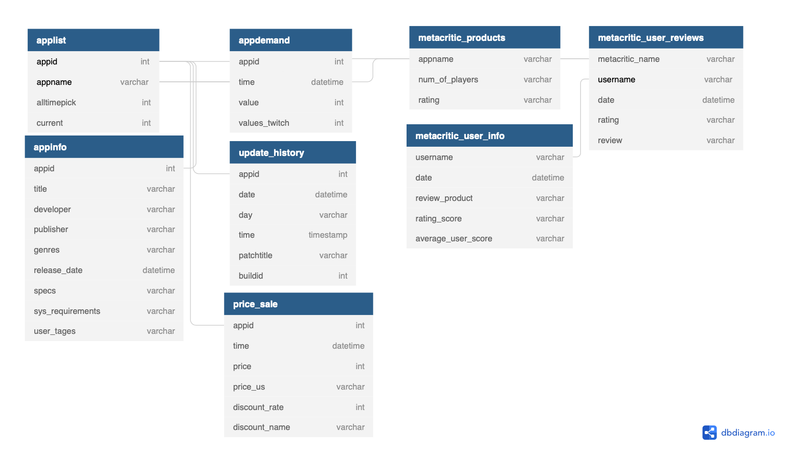

# Steam Game Data Analysis 

### This project is only for an educational purpose.


# Project structure:
1. Scraping 
    - Modified some Scrapy spiders and code accompanying the *Scraping the Steam Game Store* article published on the [Scrapinghub blog](https://blog.scrapinghub.com/2017/07/07/scraping-the-steam-game-store-with-scrapy/). 
    - Getting data from Steam, SteamDB and Metacritic.
    - It only scrape games on Steam platform based on SteamDB. 
    - SteamDB has unique panel data (price&sale history, update history, number of game players and twitch viewers)

    - To scrape data 
        1. run 'run_steamdb_scraper.sh' 
            - It runs steamdb_scraper.py 
            - It collects data from `SteamDB`. It collects game lists, price history, number of game players and twitch viewers history on game-level.
            - If you want to scrape update history, run steamdb_UH_scraper.py but you need to change coordinates because I used pyautogui. 
        2. run 'run_steam_scrapy.sh'
            - It runs steam products scrapy
            - It collects game infos on Steam website
        3.  run 'metacritic.sh'
            - It collects game infos, reviews and user info on metacritic.com

Scraped data would be like this
 

2. Data Preprocess
    - Cleansing data for analysis.
        - It includes convert data types, unpacking list, split, filtering and aggregate data.

3. Data Analysis
From this dataset, there are plenty subjects to try such as simple prediction, classification, and clustering using ML, text mining, network analysis and reccomendation system.

For my personal project, I researched impact of COVID-19 on game industry. Using extra information and data from Our World in Data.

- Hannah Ritchie, Edouard Mathieu, Lucas Rodés-Guirao, Cameron Appel, Charlie Giattino, Esteban Ortiz-Ospina, Joe Hasell, Bobbie Macdonald, Diana Beltekian and Max Roser (2020) - "Coronavirus Pandemic (COVID-19)". Published online at OurWorldInData.org. Retrieved from: 'https://ourworldindata.org/coronavirus' [Online Resource]

### My subject for Analysis

`Impact of the COVID-19 Pandemic on Consumer Demand and Price Discount in the Game Industry`  

[Code and detail of analysis](https://github.com/wj-choi9473/Steam_project/blob/main/data_analysis/2.Research.ipynb)  

The coronavirus (COVID-19) pandemic’s stay-at-home order and quarantine have led to a great impact on an individual's physical and mental health as well as a lot of industries. However, the game industry has not been closely examined. This research analyzes data from Steam, the biggest digital game distribution platform. According to empirical evidence, the COVID-19 outbreak significantly increased the demand for games, especially multiplayer games. Moreover, results show that there is an additional discount effect under COVID-19 among different characteristics of games. 


### Structure
```
📦steam_project
 ┣ 📂data
 ┃ ┣ 📂additional_data 
 ┃ ┣ 📂crawled_data                   
 ┃ ┗ 📂preprocessed_data 
 ┃
 ┣ 📂data_analysis
 ┃ ┣ 📜0.preprocess_crawled_data.ipynb
 ┃ ┣ 📜1.Basic_analysis.ipynb
 ┃ ┣ 📜2.Covid19_and_Gameindustry_Report.ipynb
 ┃ ┣ 📜analysis_tool.py # functions for econometric analysis
 ┃ ┗ 📜basic_preprocess.py # Preprocess raw data for analysis
 ┃             
 ┣ 📂metacritic_scraper
 ┃ ┣ 📂metacritic
 ┃ ┃ ┣ 📂spiders
 ┃ ┃ ┃ ┣ 📜product_spider.py           # Scraping product information that were not able to scrape from steam (e.g. ESRB Ratings)
 ┃ ┃ ┃ ┗ 📜user_spider.py              # Scraping user information who wrote and rated games on Steam
 ┃ ┃ ┣ 📜items.py
 ┃ ┃ ┣ 📜metacritic_review_scraper.py  # Scraping using BeautifulSoup and requests. This file in Not a part of scrapy framework. 
 ┃ ┃ ┣ 📜middlewares.py
 ┃ ┃ ┣ 📜pipelines.py
 ┃ ┃ ┗ 📜settings.py
 ┃ ┃
 ┣ 📂steam_scraper
 ┃ ┣ 📂steam
 ┃ ┃ ┣ 📂spiders
 ┃ ┃ ┃ ┗ 📜product_spider.py           # Scraping product informations on steam.
 ┃ ┃ ┣ 📜items.py
 ┃ ┃ ┣ 📜middlewares.py
 ┃ ┃ ┣ 📜pipelines.py
 ┃ ┃ ┣ 📜settings.py
 ┃ ┃ ┣ 📜steamdb_UH_scraper.py         # Scraping update history of each games.
 ┃ ┃ ┗ 📜steamdb_scraper.py            # Scraping SteamDB to collect game lists on steam, price history, number of game players and twitch viewers history data.
 ┣ 📜README.md
 ┣ 📜run_metacritic.sh
 ┣ 📜run_steam_scrapy.sh
 ┗ 📜run_steamdb_scraper.sh
```
 